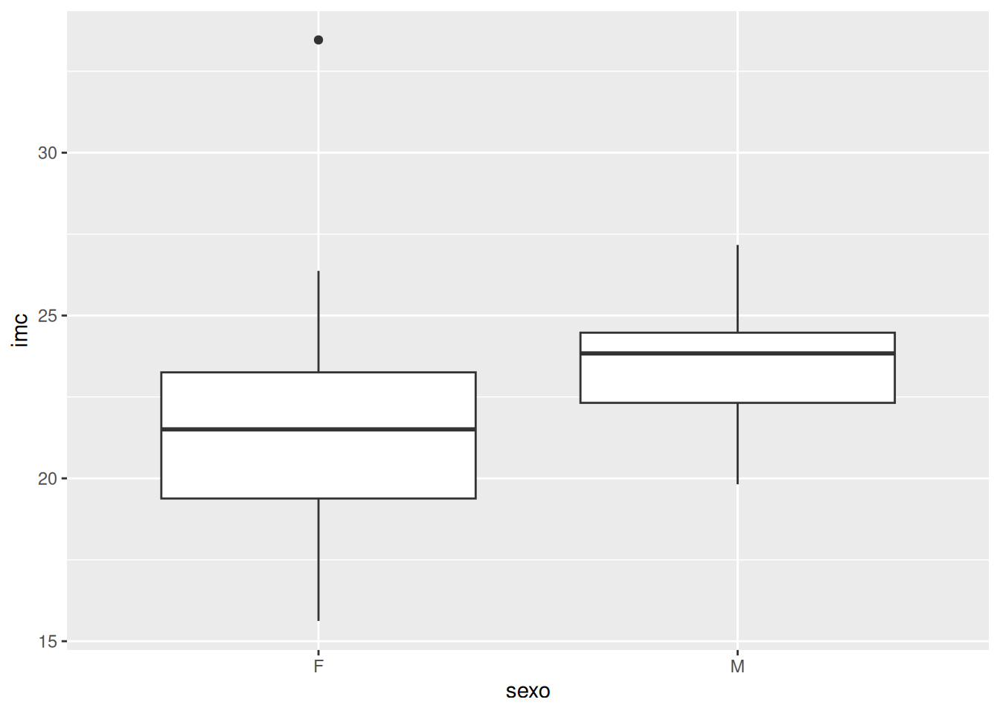
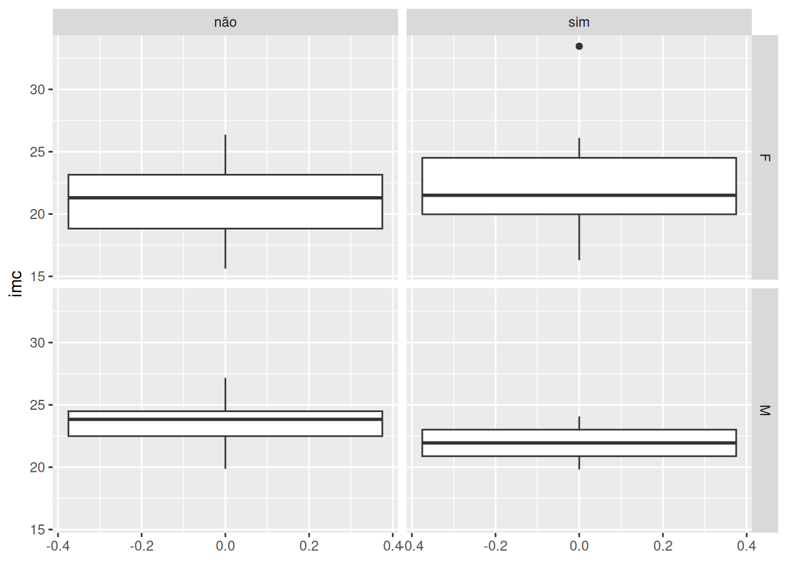

# Nutrição

``` r
library(tidyverse)
library(useR)

# carregando os dados
data(nutricao)
# visualizando:
glimpse(nutricao)
```

    Rows: 44
    Columns: 9
    $ sexo         <chr> "M", "M", "F", "F", "M", "F", "F", "M", "F", "F", "F", "F…
    $ idade        <int> 34, 17, 19, 22, 18, 22, 18, 21, 18, 18, 20, 21, 18, 17, 1…
    $ peso         <int> 75, 89, 48, 48, 58, 64, 52, 75, 56, 46, 64, 60, 66, 67, 5…
    $ altura       <dbl> 1.72, 1.81, 1.54, 1.55, 1.54, 1.56, 1.55, 1.75, 1.65, 1.6…
    $ alimentacao  <chr> "sim", "não", "sim", "não", "sim", "sim", "não", "sim", "…
    $ frutas       <int> 1, 2, 2, 1, 2, 1, 2, 2, 2, 2, 2, 1, 1, 4, 3, 2, 3, 1, 4, …
    $ vegetais     <int> 2, 4, 4, 4, 1, 2, 4, 1, 1, 2, 1, 2, 2, 2, 2, 6, 3, 6, 2, …
    $ sedentarismo <chr> "não", "não", "não", "sim", "não", "não", "sim", "não", "…
    $ tempo        <chr> "entre 2 e 5 horas", "entre 5 e 10 horas", "entre 2 e 5 h…

## Manipulações e sumários

A função
[`dplyr::summarise()`](https://dplyr.tidyverse.org/reference/summarise.html)
nos permite criar variados tipos de sumários do nosso conjunto de dados:

``` r
nutricao %>%
  summarise(
    min = min(peso),
    media = mean(peso),
    mediana = median(peso),
    max = max(peso),
    dp = sd(peso),
    cv = cv(peso)
  )
```

      min media mediana max       dp       cv
    1  39 61.25      61  90 10.88657 17.77399

> **Warning**
>
> Mais adiante mostraremos uma forma alternativa (e na minha opinião
> mais interessante!) para obter o sumário apresentado acima.

Frequentemente na prática temos interesse em sumarizar variáveis
quantitativas de acordo com os níveis de uma ou mais variáveis
categóricas. Isso pode ser facilmente feito no `R` combinando as funções
[`dplyr::summarise()`](https://dplyr.tidyverse.org/reference/summarise.html)
e
[`dplyr::group_by()`](https://dplyr.tidyverse.org/reference/group_by.html),
conforme ilustrado no exemplo abaixo:

``` r
nutricao %>%
  group_by(sexo, sedentarismo) %>%
  summarise(
    media = mean(peso),
    dp = sd(peso)
  )
```

    # A tibble: 4 × 4
    # Groups:   sexo [2]
      sexo  sedentarismo media    dp
      <chr> <chr>        <dbl> <dbl>
    1 F     não           57    8.30
    2 F     sim           60   11.8
    3 M     não           70.8  8.83
    4 M     sim           69   12.7 

> **Note**
>
> A função
> [`dplyr::summarise()`](https://dplyr.tidyverse.org/reference/summarise.html)
> usada em conjunto com a função
> [`dplyr::group_by()`](https://dplyr.tidyverse.org/reference/group_by.html)
> fornece um sumário para cada combinação de níveis das variáveis
> categóricas fornecidas para a função
> [`dplyr::group_by()`](https://dplyr.tidyverse.org/reference/group_by.html)

Uma outra função bastante útil quando estamos trabalhando com a função
[`dplyr::summarise()`](https://dplyr.tidyverse.org/reference/summarise.html)
é a função
[`dplyr::across()`](https://dplyr.tidyverse.org/reference/across.html),
conforme ilustrado nos exemplos apresentados a seguir:

``` r
# várias variáveis, uma função:
nutricao %>%
  summarise(
    across(c(peso, altura), mean)
  )
```

       peso   altura
    1 61.25 1.663864

``` r
# uma variável, várias funções:
nutricao %>%
  summarise(
    across(peso, list(min = min, mediana=median, media=mean, max=max, dp=sd, cv=cv))
  )
```

      peso_min peso_mediana peso_media peso_max  peso_dp  peso_cv
    1       39           61      61.25       90 10.88657 17.77399

``` r
# mudando os nomes na saída:
nutricao %>%
  summarise(
    across(peso, list(min = min, mediana=median, media=mean, max=max, dp=sd, cv=cv), .names = "{.fn}")
  )
```

      min mediana media max       dp       cv
    1  39      61 61.25  90 10.88657 17.77399

``` r
# combinando across e group_by
nutricao %>%
  group_by(sexo) %>%
  summarise(
    across(peso, list(min = min, mediana=median, media=mean, max=max, dp=sd, cv=cv), .names = "{.fn}")
  )
```

    # A tibble: 2 × 7
      sexo    min mediana media   max    dp    cv
      <chr> <int>   <int> <dbl> <int> <dbl> <dbl>
    1 F        39      59  58.2    90  9.78  16.8
    2 M        58      70  70.5    89  8.89  12.6

``` r
nutricao %>%
  group_by(sexo, sedentarismo) %>%
  summarise(
    across(peso, list(min = min, mediana=median, media=mean, max=max, dp=sd, cv=cv), .names = "{.fn}")
  )
```

    # A tibble: 4 × 8
    # Groups:   sexo [2]
      sexo  sedentarismo   min mediana media   max    dp    cv
      <chr> <chr>        <int>   <dbl> <dbl> <int> <dbl> <dbl>
    1 F     não             39    57.5  57      70  8.30  14.6
    2 F     sim             46    60    60      90 11.8   19.7
    3 M     não             58    70    70.8    89  8.83  12.5
    4 M     sim             60    69    69      78 12.7   18.4

Agora vamos utilizar a função
[`dplyr::where()`](https://tidyselect.r-lib.org/reference/where.html)
para calcular a média e o desvio padrão para todas as variáveis
quantitativas do nosso banco de dados:

``` r
media <- nutricao %>%
  summarise(across(where(is.numeric), mean))
media
```

         idade  peso   altura   frutas vegetais
    1 19.61364 61.25 1.663864 1.931818 2.613636

``` r
dp <- nutricao %>% 
  summarise(across(where(is.numeric), sd))
dp
```

         idade     peso     altura    frutas vegetais
    1 3.229342 10.88657 0.08084484 0.8995536 1.497531

Agora vamos contriuir uma nova tabela juntando as médias e desvio
padrões obtidos no passo anterior. Para realizar essa tarefa
precisaremos do auxílio das funções `dply::bind_rows()` e
[`dplyr::bind_cols()`](https://dplyr.tidyverse.org/reference/bind_cols.html):

``` r
estatisticas <- data.frame(
  estatistica = c("media", "dp") 
)
estatisticas
```

      estatistica
    1       media
    2          dp

``` r
tb <- bind_rows(media, dp)
tb
```

          idade     peso     altura    frutas vegetais
    1 19.613636 61.25000 1.66386364 1.9318182 2.613636
    2  3.229342 10.88657 0.08084484 0.8995536 1.497531

``` r
tb <- bind_cols(estatisticas, tb)
tb
```

      estatistica     idade     peso     altura    frutas vegetais
    1       media 19.613636 61.25000 1.66386364 1.9318182 2.613636
    2          dp  3.229342 10.88657 0.08084484 0.8995536 1.497531

## Transformações

O Índice de Massa Corpórea (IMC) é uma medida internacional usada para
avaliar nosso peso ideal. Seu cálculo é feito dividindo-se o peso pela
altura elevada ao quadrado, isto é,

$$\text{imc} = \frac{\text{peso}}{\text{altura}^{2}}.$$

A [Table 1](#tbl-imc) fornece uma classificação simplificada do IMC.

|         faixa         | classificação |
|:---------------------:|:-------------:|
|      imc \< 18.5      |    magreza    |
| 18.5 $\leq$ imc \< 25 |   saudável    |
|  25 $\leq$ imc \< 30  | pré-obesidade |
|     $imc \geq$ 30     |   obesidade   |

Table 1: Classificação simplificada do IMC.

Suponha que temos interesse em investigar o IMC em função do sexo dos
alunos. A função
[`dplyr::mutate()`](https://dplyr.tidyverse.org/reference/mutate.html)
pode ser utilizada tanto para modificarmos variáveis existentes no nosso
banco de dados, quanto para criarmos novas variáveis.

Vamos utilizar a função
[`dplyr::mutate()`](https://dplyr.tidyverse.org/reference/mutate.html)
para alterar a classe da variável `sexo` e criarmos a variável imc:

``` r
library(useR)
library(tidyverse)

data(nutricao)
glimpse(nutricao)
```

    Rows: 44
    Columns: 9
    $ sexo         <chr> "M", "M", "F", "F", "M", "F", "F", "M", "F", "F", "F", "F…
    $ idade        <int> 34, 17, 19, 22, 18, 22, 18, 21, 18, 18, 20, 21, 18, 17, 1…
    $ peso         <int> 75, 89, 48, 48, 58, 64, 52, 75, 56, 46, 64, 60, 66, 67, 5…
    $ altura       <dbl> 1.72, 1.81, 1.54, 1.55, 1.54, 1.56, 1.55, 1.75, 1.65, 1.6…
    $ alimentacao  <chr> "sim", "não", "sim", "não", "sim", "sim", "não", "sim", "…
    $ frutas       <int> 1, 2, 2, 1, 2, 1, 2, 2, 2, 2, 2, 1, 1, 4, 3, 2, 3, 1, 4, …
    $ vegetais     <int> 2, 4, 4, 4, 1, 2, 4, 1, 1, 2, 1, 2, 2, 2, 2, 6, 3, 6, 2, …
    $ sedentarismo <chr> "não", "não", "não", "sim", "não", "não", "sim", "não", "…
    $ tempo        <chr> "entre 2 e 5 horas", "entre 5 e 10 horas", "entre 2 e 5 h…

``` r
nutricao <- nutricao %>%
  mutate(
    sexo = as.factor(sexo),
    imc = peso/(altura^2)
  )
glimpse(nutricao)
```

    Rows: 44
    Columns: 10
    $ sexo         <fct> M, M, F, F, M, F, F, M, F, F, F, F, F, F, F, F, F, F, F, …
    $ idade        <int> 34, 17, 19, 22, 18, 22, 18, 21, 18, 18, 20, 21, 18, 17, 1…
    $ peso         <int> 75, 89, 48, 48, 58, 64, 52, 75, 56, 46, 64, 60, 66, 67, 5…
    $ altura       <dbl> 1.72, 1.81, 1.54, 1.55, 1.54, 1.56, 1.55, 1.75, 1.65, 1.6…
    $ alimentacao  <chr> "sim", "não", "sim", "não", "sim", "sim", "não", "sim", "…
    $ frutas       <int> 1, 2, 2, 1, 2, 1, 2, 2, 2, 2, 2, 1, 1, 4, 3, 2, 3, 1, 4, …
    $ vegetais     <int> 2, 4, 4, 4, 1, 2, 4, 1, 1, 2, 1, 2, 2, 2, 2, 6, 3, 6, 2, …
    $ sedentarismo <chr> "não", "não", "não", "sim", "não", "não", "sim", "não", "…
    $ tempo        <chr> "entre 2 e 5 horas", "entre 5 e 10 horas", "entre 2 e 5 h…
    $ imc          <dbl> 25.35154, 27.16645, 20.23950, 19.97919, 24.45606, 26.2984…

Agora vamos utilizar a [Table 1](#tbl-imc) para criarmos uma variável
com a classificação dos estudantes:

``` r
# criando a faixa de valores:
faixa <- c(0, 18.5, 25, 30, Inf)

# incluindo a classificação no banco de dados:
nutricao <- nutricao %>%
  mutate(
    classificacao = cut(imc, faixa)
  )
glimpse(nutricao)
```

    Rows: 44
    Columns: 11
    $ sexo          <fct> M, M, F, F, M, F, F, M, F, F, F, F, F, F, F, F, F, F, F,…
    $ idade         <int> 34, 17, 19, 22, 18, 22, 18, 21, 18, 18, 20, 21, 18, 17, …
    $ peso          <int> 75, 89, 48, 48, 58, 64, 52, 75, 56, 46, 64, 60, 66, 67, …
    $ altura        <dbl> 1.72, 1.81, 1.54, 1.55, 1.54, 1.56, 1.55, 1.75, 1.65, 1.…
    $ alimentacao   <chr> "sim", "não", "sim", "não", "sim", "sim", "não", "sim", …
    $ frutas        <int> 1, 2, 2, 1, 2, 1, 2, 2, 2, 2, 2, 1, 1, 4, 3, 2, 3, 1, 4,…
    $ vegetais      <int> 2, 4, 4, 4, 1, 2, 4, 1, 1, 2, 1, 2, 2, 2, 2, 6, 3, 6, 2,…
    $ sedentarismo  <chr> "não", "não", "não", "sim", "não", "não", "sim", "não", …
    $ tempo         <chr> "entre 2 e 5 horas", "entre 5 e 10 horas", "entre 2 e 5 …
    $ imc           <dbl> 25.35154, 27.16645, 20.23950, 19.97919, 24.45606, 26.298…
    $ classificacao <fct> "(25,30]", "(25,30]", "(18.5,25]", "(18.5,25]", "(18.5,2…

Recodificando os níveis da variável `classificacao` com o auxílio da
função
[`dplyr::recode()`](https://dplyr.tidyverse.org/reference/recode.html):

``` r
nutricao <- nutricao %>%
  mutate(
    classificacao = recode(
      classificacao, 
      "(0,18.5]" = "magreza",
      "(18.5,25]" = "saudavel",
      "(25,30]" = "pre-obesidade",
      "(30,Inf]" = "obesidade",
    )
  )

# verificando:
levels(nutricao$classificacao)
```

    [1] "magreza"       "saudavel"      "pre-obesidade" "obesidade"    

Suponha agora que nós temos o interesse em obter uma tabela de
contingência para as variáveis `sexo` e `classificacao`.

``` r
tb <- nutricao %>%
  group_by(sexo, classificacao) %>%
  summarise(
    n = n()
  ) %>%
  mutate(
    p = n/sum(n)
  )
tb
```

    # A tibble: 6 × 4
    # Groups:   sexo [2]
      sexo  classificacao     n      p
      <fct> <fct>         <int>  <dbl>
    1 F     magreza           6 0.182
    2 F     saudavel         23 0.697
    3 F     pre-obesidade     3 0.0909
    4 F     obesidade         1 0.0303
    5 M     saudavel          9 0.818
    6 M     pre-obesidade     2 0.182 

``` r
class(tb)
```

    [1] "grouped_df" "tbl_df"     "tbl"        "data.frame"

Precisamos alterar a classe do objeto `tb` para data.frame de modo a
obtermos as frequências relativas relativas ao total geral:

``` r
tb <- tb %>%
  as.data.frame() %>%
  mutate(
    p = n/sum(n)
  )
tb
```

      sexo classificacao  n          p
    1    F       magreza  6 0.13636364
    2    F      saudavel 23 0.52272727
    3    F pre-obesidade  3 0.06818182
    4    F     obesidade  1 0.02272727
    5    M      saudavel  9 0.20454545
    6    M pre-obesidade  2 0.04545455

Finalmente, para obtermos a tabela de contingência desejada, vamos
utilizar as funções
[`dplyr::select()`](https://dplyr.tidyverse.org/reference/select.html) e
`tidyr::pivot_winder()`:

``` r
# frequência absoluta:
tb %>%
  select(-p) %>%
  pivot_wider(
    values_from = n,
    names_from = classificacao,
  )
```

    # A tibble: 2 × 5
      sexo  magreza saudavel `pre-obesidade` obesidade
      <fct>   <int>    <int>           <int>     <int>
    1 F           6       23               3         1
    2 M          NA        9               2        NA

``` r
# para completar com zero:
tb %>%
  select(-p) %>%
  pivot_wider(
    values_from = n,
    names_from = classificacao,
    values_fill = 0
  )
```

    # A tibble: 2 × 5
      sexo  magreza saudavel `pre-obesidade` obesidade
      <fct>   <int>    <int>           <int>     <int>
    1 F           6       23               3         1
    2 M           0        9               2         0

``` r
# frequência relativa:
tb %>%
  select(-n) %>%
  pivot_wider(
    values_from = p,
    names_from = classificacao,
    values_fill = 0
  )
```

    # A tibble: 2 × 5
      sexo  magreza saudavel `pre-obesidade` obesidade
      <fct>   <dbl>    <dbl>           <dbl>     <dbl>
    1 F       0.136    0.523          0.0682    0.0227
    2 M       0        0.205          0.0455    0     

No código acima a função
[`dplyr::select()`](https://dplyr.tidyverse.org/reference/select.html)
seleciona a variável que será excluida do tibble `tb`, enquanto a função
[`tidyr::pivot_wider()`](https://tidyr.tidyverse.org/reference/pivot_wider.html)

> **Note**
>
> Estudaremos a função
> [`tidyr::pivot_wider()`](https://tidyr.tidyverse.org/reference/pivot_wider.html),
> bem com a função `tidyr::pivot_long()`, mais adiante em nosso curso.

A média do IMC por sexo pode ser obtida da seguinte forma:

``` r
ggplot(nutricao, aes(x=sexo, y=imc)) +
  geom_boxplot()
```



``` r
ggplot(nutricao, aes(y=imc)) +
  geom_boxplot() +
  facet_grid(sexo ~ sedentarismo)
```


